# Apple Store 抢单成功率与提速深度优化方案

本文档基于 Apple 官网到店自提（Retail Store Pickup）与预约抢购的真实业务链路，从**交互响应、会话保活、网络基建、防风控策略**等维度，系统性梳理进一步提升抢单成功率的优化空间。

---

## 核心痛点与时间分布现状

在标准的“监控到货 → 唤起浏览器 → 抢购下单”流程中，各阶段的大致耗时分布如下：

```mermaid
gantt
    title 抢单各环节时间分布
    dateFormat  X
    axisFormat %s 秒
    section 现状
    发现库存 (轮询)        :0, 1
    冷启动浏览器 & 载入页面 :1, 4
    时段加载 & DOM渲染     :4, 5.5
    人工/普通脚本选择填写  :5.5, 7
    提交锁单               :7, 8
    section 极致优化后
    发现库存 (低延迟通道)  :0, 0.5
    常驻标签页直接刷新/换参 :0.5, 1.2
    首个可用时段盲选 & 填表:1.2, 1.5
    提交锁单               :1.5, 2.0
```



> **核心瓶颈**：绝大多数抢单失败并非监控不够快，而是**从唤起浏览器到完成重前端页面水合（Hydration）消耗了 2~3 秒**。在这 2~3 秒内，稀缺热门机型（如 Pro 系列暗色首发、特定门店配额）往往已被抢空。

---

## 一、 交互与执行链路优化（预期节省 1.5s ~ 3s）

### 1. 浏览器常驻预热池（Warm Tab 机制）
* **现状**：
  监听到库存后通过系统命令唤起系统默认浏览器，经历「进程冷启动 → DNS 解析 → SSL 握手 → 下载数 MB 前端 JS/CSS 资源 → Vue/React 页面水合」。
* **优化方案**：
  - 抢购前提前在 Chrome/Edge 中打开专用的抢购标签页，停留在 Apple 商店页面（或购物车页面）。
  - 监控端命中库存后，通过 WebSocket 或本地 Localhost HTTP 服务向已常驻的前端扩展/油猴脚本发送指令，直接触发前台激活与页面参数注入。
* **收益**：立省 **1.5 ~ 3 秒** 的冷启动和全量资源加载时间。

### 2. 直达直跳链接（Deep Link），绕过商品展示页
* **现状**：
  直接跳转至商品主展示页（如 `/shop/buy-iphone/...`），该页面包含 3D 渲染模型、多颜色切换、配置对比、配件推荐等巨型组件。
* **优化方案**：
  - 分析加购 Direct Link 或带有具体 `product`、`step` 参数的深层入口链接，直接跳过选外观/选配置的复杂中间交互，直通取货门店与时段选择环节。
* **收益**：大幅减少无用组件的渲染开销与内存占用。

### 3. 压制 CSS 动画与无用静态资源
* **现状**：
  苹果结账流中包含大量浮层展开、抽屉弹窗、渐变过渡动画（通常有 200~400ms 的 Transition 时延）。
* **优化方案**：
  - 注入强制样式压制全局过渡效果：
    ```css
    *, *::before, *::after {
      transition: none !important;
      animation: none !important;
    }
    ```
  - 拦截无关的埋点上报（如 `metrics.apple.com`、分析脚本）及大尺寸宣传背景图，确保核心表单与按钮在 100~200ms 内立即可点。
* **收益**：节省 **300ms ~ 500ms** 交互等待时间。

---

## 二、 账户与会话保活（消除 100% 致命阻断）

### 1. Apple ID 登录态长效心跳保活（Heartbeat Ping）
* **痛点**：
  苹果的登录态在闲置一段时间后会退化。如果在抢购的紧要关头进入结账页面突然被重定向到 `idmsa.apple.com` 触发双重认证（2FA），抢单直接失败。
* **优化方案**：
  - 保持后台定时（如每 5~10 分钟）静默发起一次带 Cookie 的轻量级心跳请求（例如访问 `/shop/account/home` 或拉取账户配置），使 Session 始终处于活跃和已授权状态。
* **收益**：彻底杜绝临门一脚弹 2FA 或重新扫码登录的问题。

### 2. 账号后台预设取货人与发票
* **优化方案**：
  - 提前在 Apple ID 官网的【账户与取货地址】中将取货人姓名、手机号、身份证后 4 位填入默认预设。
  - 当页面加载时，系统会自动预先选中默认自提人，进一步降低脚本依赖。

---

## 三、 网络基建与节点调优（降低 50ms ~ 150ms）

### 1. 监控 IP 与下单 IP 解耦（隔离风控风险）
* **痛点**：
  如果客户端本地以 1~2 秒/次的频率高频轮询苹果接口，该公网 IP 极易被 Akamai / 苹果 WAF 标记为高频爬虫，导致下单时被弹人机验证码（hCaptcha/Arkose Labs）或受到接口限制。
* **优化方案**：
  - **监控流量**：使用多节点代理或云函数轮换轮询。
  - **下单流量**：严格保留并使用纯净的家庭宽带原生 IP。

### 2. Apple CDN 节点 Hosts 优选（降低 RTT）
* **优化方案**：
  - 苹果在国内使用了多家 CDN（包括 Akamai、Fastly、阿里云等边缘节点）。
  - 在抢购前使用脚本针对 `store.apple.com.cn` 和 `www.apple.com.cn` 进行全网测速，找出当前运营商（电信/联通/移动）下延迟最低、丢包率最低的直连 IP，写入本地 `/etc/hosts`。
* **收益**：将每次接口往返延迟（RTT）从 80~120ms 压缩到 **15~30ms**。

---

## 四、 预约时段与容灾策略

### 1. 盲选最早可用时段（First Available Slot）
* 面对热门抢购，无需挑选具体时段（如特定下午时间），只要能够锁定生成订单，通常当天营业时间内均可前往提货。
* 脚本始终严格监听并第一时间选择**首个渲染出的可用 Radio**，并在 50ms 内触发 `change` 与继续。

### 2. 遭遇高并发占位冲突时的毫秒级原位重试
* 当多人同时锁定同一个时段时，后端接口可能返回时段不可用。
* 脚本不应刷新全页，而应留在当前页立即递补勾选**下一个相邻时段**并再次点击提交，形成闭环自愈。

---

## 五、 优化优先级建议表

| 优化项 | 预期节省耗时 / 提升点 | 实施难度 | 推荐等级 |
| :--- | :--- | :--- | :--- |
| **浏览器常驻预热 (Warm Tab)** | 节省 **1500ms ~ 3000ms** | 中等 | ⭐⭐⭐⭐⭐ **最高优先级** |
| **登录态 Heartbeat 保活** | 彻底避免抢购瞬间被弹 2FA | 低 | ⭐⭐⭐⭐⭐ **必做基石** |
| **动画压制与首时段盲选** | 节省 **300ms ~ 500ms** | 低 | ⭐⭐⭐⭐ **立竿见影** |
| **监控 IP 与下单 IP 分离** | 彻底防范高频监控触发 WAF 验证码 | 中等 | ⭐⭐⭐⭐ |
| **CDN IP Hosts 优选** | 降低 **50ms ~ 100ms** 延迟 | 低 | ⭐⭐⭐ |
